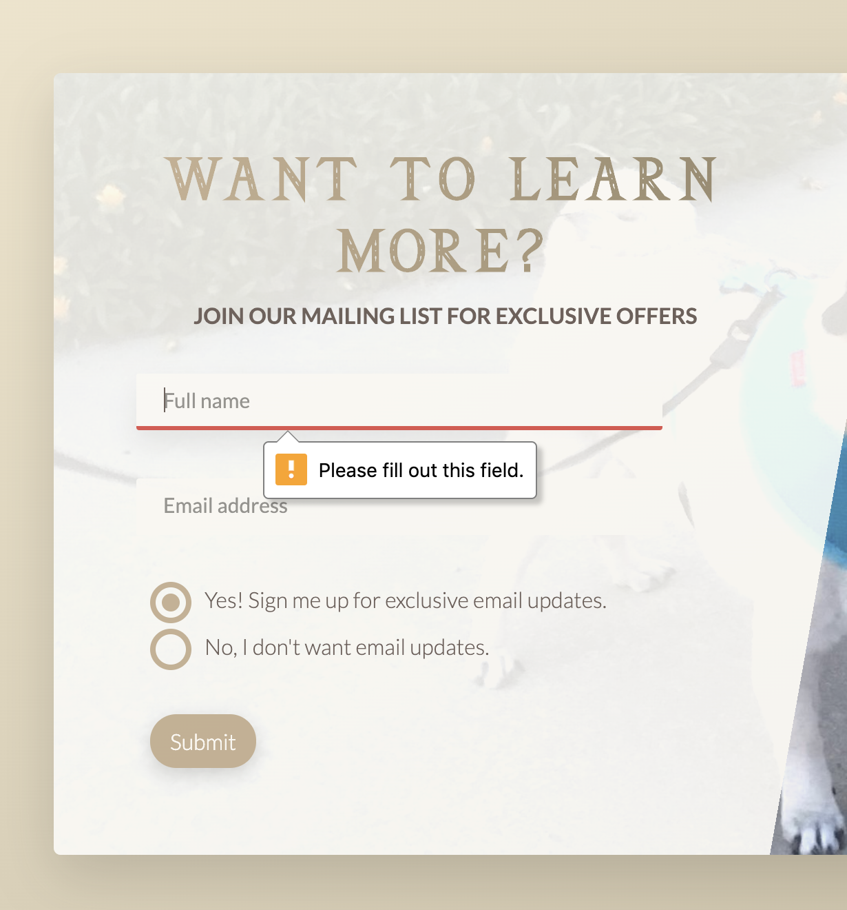

# The Legend of Marceline
A promotional website designed and built for a fictional adventure game inspired by "The Legend of Zelda". Built entirely with HTML and CSS code compiled with Sass; no open source CSS frameworks were used.

# Motivation
*Why does this project exist?*
* To practice, enhance, and showcase my skills in front-end web design and development.
* To provide a template for those looking to build a website with similar layout and function.
* To be a source of ideas and inspiration for other developers.
* For fun!

# Screenshots
#### Website Intro/Header Animations


#### Fullscreen Animated Navbar


#### Pop-up CSS Modal


#### Responsive Design
##### Desktop View


##### Mobile View


#### Form Validation


# Tech/framework used
**Built with:**
* HTML
* CSS
* <a href="https://sass-lang.com/" target="_blank">Sass</a>
* <a href="https://nodejs.org/en/" target="_blank">Node.js</a>
* <a href="https://www.npmjs.com/" target="_blank">npm</a>

# Features
- This website features a sleek, modern, and elegant design. It has been made responsive for screen sizes ranging from small phones to very large desktops.
- It takes advantage of CSS and pushes it to its' fullest capacity, using CSS to implement features that are typically thought to require JavaScript in order to function. ie) the pop-up modal
- Sass syntax streamlines development and makes CSS much more efficient, helping to use it to its fullest potential. 

# Code Example
### Sass
Please reference <a href="https://sass-lang.com/documentation/syntax" target="_blank">Sass documentation</a> for an understanding of how Sass was used in the development of this project.

### Custom CSS Grid
This website uses a responsive CSS grid similar to <a href="https://getbootstrap.com/" target="_blank">Bootstrap's</a>, however I wanted to challenge myself and try building my own grid.

#### To use create columns of varying width:

2 Columns - equal width
```
<div class="row">
	<div class="col-1-of-2">
		1 of 2
	</div>
	<div class="col-1-of-2">
		1 of 2
	</div>
</div>
```
3 Columns - equal width
```
<div class="row">
	<div class="col-1-of-3">
		1 of 3
	</div>
	<div class="col-1-of-3">
		1 of 3
	</div>
	<div class="col-1-of-3">
		1 of 3
	</div>
</div>
```
2 Columns - 1 wider
```
<div class="row">
	<div class="col-1-of-3">
		1 of 3
	</div>
	<div class="col-2-of-3">
		2 of 3
	</div>
</div>
```
4 Columns - equal width
```
<div class="row">
	<div class="col-1-of-4">
		1 of 4
	</div>
	<div class="col-1-of-4">
		1 of 4
	</div>
	<div class="col-1-of-4">
		1 of 4
	</div>
	<div class="col-1-of-4">
		1 of 4
	</div>
</div>
```
3 Columns - 2 equal width, 1 wider
```
<div class="row">
	<div class="col-1-of-4">
		1 of 4
	</div>
	<div class="col-1-of-4">
		1 of 4
	</div>
	<div class="col-2-of-4">
 		2 of 4
	</div>
</div>
```
2 Columns - 1 much wider
```
<div class="row">
	<div class="col-1-of-4">
		1 of 4
	</div>
	<div class="col-3-of-4">
		3 of 4
	</div>
</div>
```

### Modal Popup
This website includes an modern and responsive modal pop-up component that can be reused for multiple locations. 

#### Sample Implementation:
```
<div class="modal" id="modal">
        <div class="modal__content">
            <a href="#nav-button" class="modal__close-btn">
                <i class="modal__close-btn--icon material-icons">close</i>
            </a>
            <div class="modal__image-section">
                <!-- Image -->
            </div>
            <div class="modal__text-section">
                <!-- Text -->
            </div>
        </div>
    </div>
```

# Installation
#### Steps to get a development environment up and running:
1. Install a code editor, such as <a href="https://code.visualstudio.com/" target="_blank">VSCode</a>
2. Have a web browser ready to test your website, such as <a href="https://www.google.com/chrome/?brand=CHBD&gclid=CjwKCAjw1v_0BRAkEiwALFkj5rzKWz3km7pGWUxAOreaHuoMV4wyQ5HRYJBvFdeEAKsh5YJBdRhlAhoC2mAQAvD_BwE&gclsrc=aw.ds" target="_blank">Google Chrome</a> (recommended for its highly useful developer tools!)
3. Install <a href="https://nodejs.org/en/" target="_blank">Node.js</a> to your local computer
	- To test if it's been successfully installed, type `node -v` into your terminal and search for an output
	- If it returns the version number, then it's been installed!
4. Create a package.json file (this will contain the definitions of your package and provide the place for npm to write packages that we will use)
	- In the terminal for the project directory, run `npm init` and follow the instructions to initiate the package.json file
5. Install <a href="https://www.npmjs.com/package/node-sass" target="_blank">node-sass</a> npm package to project
	- In the terminal for the project directory, run `npm install node-sass --save-dev`
	- `--save-dev` lists the package as a developer dependency, ie) we use it during project development
6. Ready for development!

# Credits
Website architected and design modified by <a href="http://paulineann.me" class="footer__link"
                        target="_blank">Pauline Bantayan</a> in 2020.<br />
                    Initial design inspiration from Udemy course by <a
                        href="https://www.udemy.com/course/advanced-css-and-sass/" class="footer__link"
                        target="_blank">Jonas Schmedtmann</a>.<br />
                    Credit to <a href="https://www.nintendo.com/" class="footer__link" target="_blank">Nintendo</a> for
                    "The Legend of Zelda" inspiration.<br />
										Special thanks to Marceline the Pug for being the main protagonist/model. <br />
                    Icons made by <a href="https://www.flaticon.com/authors/freepik" title="Freepik"
                        class="footer__link" target="_blank">Freepik</a> from <a href="https://www.flaticon.com/"
                        title="Flaticon" class="footer__link" target="_blank">Flaticon</a><br />
                    <a class="footer__link" target="_blank" href="/icons/set/sword">Sword icon</a> and <a
                        class="footer__link" target="_blank" href="/icons/set/archers-bow">Archers Bow icon</a> by <a
                        class="footer__link" target="_blank" href="https://icons8.com">Icons8</a><br />
                    Photos by
                    <a href="https://www.pexels.com/@simonmigaj?utm_content=attributionCopyText&utm_medium=referral&utm_source=pexels"
                        class="footer__link" target="_blank">Simon Migaj</a>,
                    <a href="https://www.pexels.com/@atomlaborblog?utm_content=attributionCopyText&utm_medium=referral&utm_source=pexels"
                        class="footer__link" target="_blank">Jens Mahnke</a>,
                    <a href="https://www.pexels.com/@soumil-kumar-4325?utm_content=attributionCopyText&utm_medium=referral&utm_source=pexels"
                        class="footer__link" target="_blank">Soumil Kumar</a>,
                    <a href="https://www.pexels.com/@an-hoang-1770312?utm_content=attributionCopyText&utm_medium=referral&utm_source=pexels "
                        class="footer__link" target="_blank">An Hoàng</a>,
                    <a href="https://www.pexels.com/@charles-dominic-dass-370929" class="footer__link"
                        target="_blank">Charles Dominic Dass</a>, and
                    <a href="https://www.pexels.com/@sergei-akulich-1322276?utm_content=attributionCopyText&utm_medium=referral&utm_source=pexels"
                        class="footer__link" target="_blank">Sergei Akulich</a> from
                    <a href="https://www.pexels.com/photo/person-on-a-bridge-near-a-lake-747964/?utm_content=attributionCopyText&utm_medium=referral&utm_source=pexels"
                        class="footer__link" target="_blank">Pexels</a>, Pamela Santos, and Pauline Bantayan
